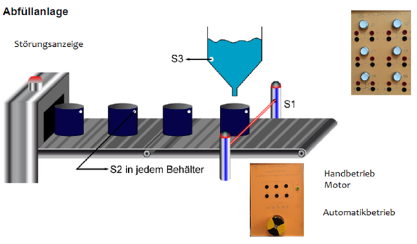
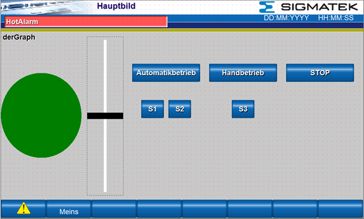
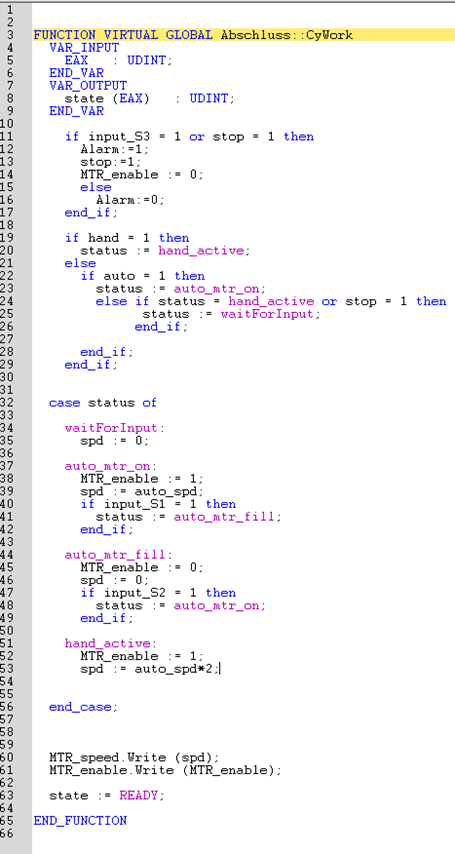
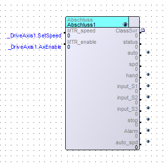

# PLC project in structured text
This is a PLC project that i did for school. It consists of code written in structured text. Here it represents a state machine.

## Assignment
When the automatic mode button is pressed, the conveyor belt is switched on and transports containers
transports containers released from a magazine to below a silo. If sensor S1 is contacted, the conveyor belt stops and the container is filled with liquid until sensor until sensor S2 responds. When the container is full, it is conveyed further. There should be a manual operation (pushbutton) for faster (V-motor x 2) conveyance of the conveyor belt motor be implemented. When the silo is empty, a warning lamp lights up until the silo is filled again.

## How to open the project
The `4E_Gruppe1_Graf_Projekt1` and `HM_Lasal_Screen` have to be opened in Lasal Class, `4E_Gruppe1_Graf_Projekt1` has to be uploadet to the PLC and the `HM_Lasal_Screen` to the HMI first. Then the `4E_Gruppe1_Graf_Projekt1_HMI` has to be uploaded to the HMI. The Project should work now.

## Lasal Class
First, a new project is created. The interface is now defined in the project. This is done via the button `Change Online Settings`. We connect to the PLC via LAN. For this we set the IP address of the PLC. Our PLC is on a fixed IP, so we enter the IP it. You can also find your PLC with the `FIND` button. Now we import the hardware configuration of the PLC via `Tools ==> Hardware Editor` and the button `Upload Hardware Tree from PLC`. Then a new class is created in the `Class` window and a new Net in the `Net` window. In the Class window you can create servers, clients and custom data types.

## Lasal Screen
In Lasal Screen we can configure the HMI. First we create a new server which I call "hmiStart". For this server we have to set WriteProtected to False and Visualized to True. For this we save all data in Lasal Class under the `File` menu. After that we create a new Lasal Screen Project and select the template 800x480 and open the Main Screen. Another Lasal Class window opens automatically. In this window we have to make a new connection to the HMI (see above). Then we transfer the project with the `F6` key. Back in Lasal Screen we create a new button under Draw. After that we have to import our variables under `Project ==> Reference to Variables` where we create a new link and navigate under Path to our Lasal Class Project. Then we have to change to TCPIP and enter the IP address of the HMI. Now we open the properties of the button and select our previously created class under Data source and confirm our selection. With the button in the top bar we can transfer the project to the HMI.

## Lasal Class motor-config
To use a inverter on the motor you have to connect it via Varan bus and then load the hardware configuration from the PLC in the hardware editor. Now a new entry should appear in the submenu `Varan 1`. Expand this entry and the subentry `Axis 0` as well. At the subentry of Axis 0 you can now execute the command `add Drive File` and klick an `other drive File`. Now open the drive file "Baumüller_20.09.16" received from our Teacher And then execute the command `Overwrite Parameters`. Then you can import the port `AxEnable` and the port `SetSpeed` from the newly created Hardware Network under `Axis 1` into your own network and now control it with the code in your own Class. In the menu `Tools ==> Motion ==> Dias Drive` the motor can be tested. In the controller setup, the speed controller service mode is selected and the rotation frequency can be set.

## Lasal Screen color scheme
To get a status light on the HMI I use the color scheme in the Lasal Screen. This is created in the right bar under `Schemes ==> Color Schemes`. With a double click on `Color Schemes` a window opens where you can create a color scheme. You can define a variable in the upper part and the controlling variable including operator in the lower part.

## Lasal Screen View

## Structured Text Code

## Class Network
